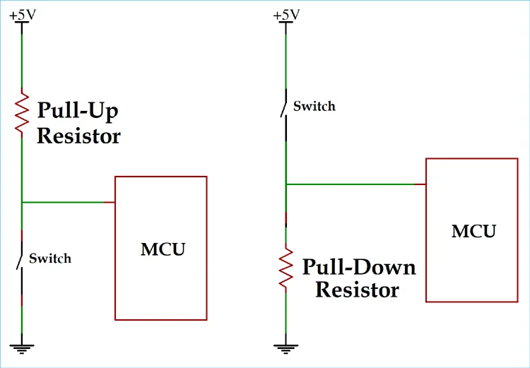
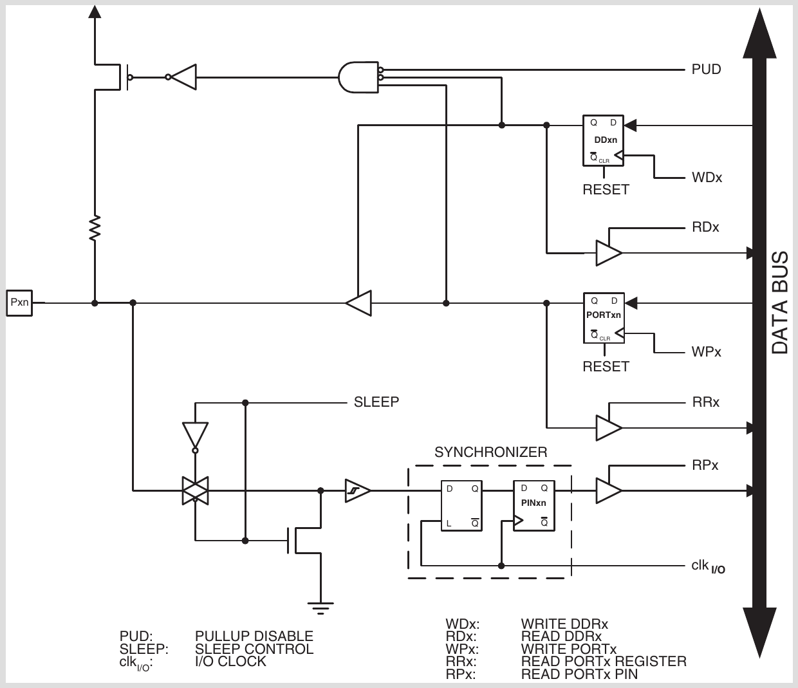

# 플로팅(Floating)상태에 관한 보고서

> **광운대학교 컴퓨터정보공학부**  
> **작성자:** 장경민  
> **제출일:** 2026. 07. 30

---

## 1. 개요 (Overview)
본 과제는 플로팅(Floating)상태에 대해 설명하고, 플로팅 상태가 문제가 되는 이유와 이를 해결하기위한 방법에 관한 보고서이다.

### 핵심 목표
* 플로팅(Floating)상태에 대해 설명
* 플로팅 상태가 문제가 되는 이유
* 플로팅 상태를 해결하기 위한 방법

---

## 2. 플로팅(Floating)상태란

플로팅 상태는 어떠한 회로가 VCC나 접지에 연결되지 않아 고임피던스 상태가 되는 현상이다. 이러한 상태에서는 저항이 무한대에 가까워서 한번 걸린 전압이 계속 유지된다. 또한 커패시턴스가 매우 낮아 조그마한 잡음(예: 손가락, 옆 회로의 간섭 등)에 민감하게 반응한다. 이 둘이 복합적으로 작용하여 스위치 등에서 알 수 없는 상태가 알 수 없는 시간 동안 유지되는 상태이다.

---

## 3. 플로팅 상태가 문제가 되는 이유
여러 핀을 하나로 묶어서 관리하는 데이터버스와 같은 부분에서는 플로팅 상태(고 임피던스)가 필요하다.  
하지만 만약 플로팅 상태가 스위치에서 발생한다면 입력핀은 0V~5V 사이의 알 수 없는 전압을 입력 받게 된다. 이러한 입력이 들어온다면, 현재 스위치가 눌렀는지 안눌렀는지 정확히 알 수 없다. 만약 플로팅 상태의 스위치에서 이전에 전압이 걸렸다면, 이 스위치 회로는 무한대의 저항을 가지고 있어서 스위치를 떼도 이전의 입력을 계속 가지고 있을 수 있다. 또한 외부의 충격, 간섭이나 옆 회로의 노이즈 등으로 입력 값이 쉽게 변화할수 있다.  
플로팅 상태가 스피커와 같은 부분에서 발생한다면 잡음이 들리거나 스피커가 고장날 수 있다.

## 4. 플로팅 상태를 해결하기 위한 방법
우리가 만드는 회로 중에 플로팅 상태가 문제가 되는 회로는 보통 스위치 회로이다. 이는 아래 사진과 같은 풀업/풀다운 저항을 이용하면 매우 쉽게 해결할 수 있다.

혹은 SPDT와 같이 한쪽을 무조건 VCC / GND에 연결하는 스위치를 사용할수도 있다.  
ATMega128의 모든 핀에는 아래와 같은 PUD(Pull-up-disable) 레지스터와 풀업 회로를 내장하고 있다. 

왼쪽 위의 MOSFET과 연결된 PUD라인 PORTx를 이용하면 내장된 풀업 회로를 사용할수 있다.

## 5. AI 툴 활용 명시 (AI Tools Declaration)
본 과제 작성 및 구현 과정에서 활용한 AI 도구(Generative AI)는 전부 **Claude AI**를 활용함

 활용 영역 | 세부 사용 목적 및 내용 |
 :--- | :--- |
 정의 관련 궁금증 해결 | - 스위치의 플로팅 상태에서 스위치와 입력 핀 사이의 상태를 커패서터과 같은 역활을 한다고 할 수 있는가? |
| 플로팅 상태 해결법 | - 풀업, 풀다운, MCU내의 설정 이외에 플로팅 상태 해결법 |
| 회로도 기호 식별 | - 회로도 그림을 주고 기호를 식별함 |
| 맞춤법 및 단어 교정 | - 보고서의 맞춤법 및 단어 교정에 도움을 받음 |

### AI 활용 및 검증 원칙
1. **궁금증 해결 :** 모르는 거나 궁금한것을 AI한테 물어본다.
2. **학습 주도성:** 코드의 핵심 제어 로직 설계는 직접 작성하였으며, AI는 보조 도구(디버깅, 문서화)로만 활용하였습니다.