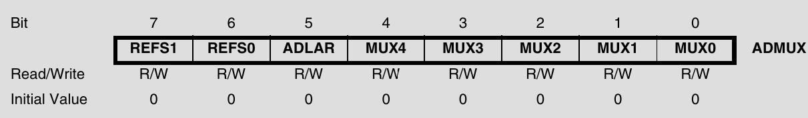
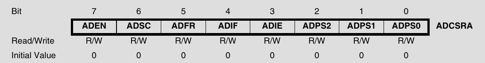
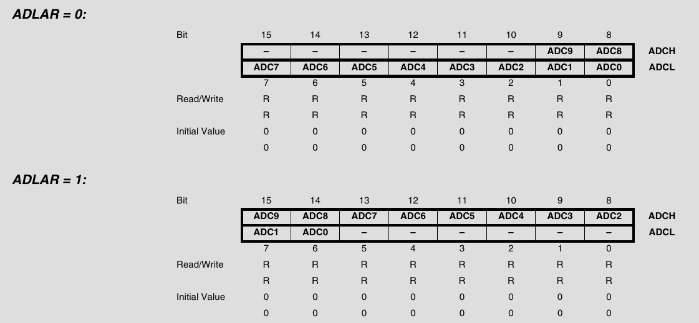
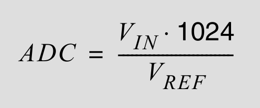
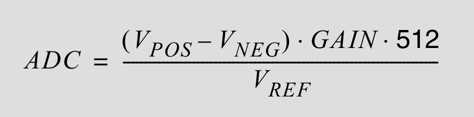

# 데이터 시트 ADC 파트에 관한 보고서

> **광운대학교 컴퓨터정보공학부**  
> **작성자:** 장경민  
> **제출일:** 2026. 07. 30

---

## 1. 개요 (Overview)
데이터 시트 ADC 파트를 번역하여 공부하고 공부한 내용을 요약한 보고서이다. ADC는 230pg 부터 245pg까지 16pg로 구성되어 있다. 이를 읽고 이해한 것과 약간의 내 생각을 간단히 요약하였다.

---

## 2. 레지스터

아날로그 전압을 입력받기 위해서는 다음의 2개의 레지스터를 설정하여야 한다.  
- ADMUX (ADC Multiplexer
Selection Register)
- ADCSRA (ADC Control and
Status Register A)  

아날로그 전압의 출력은 2개의 레지스터를 이용하여 받는다.  
- ADCL/ADCH (The ADC Data Register)

### 2.1 ADMUX (ADC Multiplexer Selection Register)

  
- Bit 7:6 (REFS1:0) - 기준 전압을 설정하는 부분이다.  
외부의 AREF, 외부의 AVCC 내부의 2.56V 3가지 중 하나를 선택할 수 있는데, 보통은 AVCC를 사용한다. (확인요망)우리가 사용하는 보드는 5V(VCC와) AVCC가 연결된것을 사용하여 딱히 건들 필요는 없다.  
- Bit 5 (ADLAR) - ADC결과를 좌/우로 정렬하는 비트이다.  
 예제 코드에서는 이미 예약어인 ADC 를 이용하여 값을 받아 왔지만, 실제로는 ADCL, ADCH 2개의 레지스터를 이용해 값을 받는다.(개별 레지스터는 8bit인데 ADC 값의 출력은 10bit 이므로) 이때 ADCH, ADCL 2개의 레지스터에서 출력을 좌/우측에 맞추어 정렬할때 사용한다. 좌로 정렬(bit = 1)을 하여도 ADC를 가져올 수 있지만 좌로 정렬은 보통 8bit로 끊어서 사용할 때 사용한다.
- Bit 4:0 (MUX4:0) - 멀티플렉서에 값을 넣을때 사용한다.  
ATMega128에는 ADC 회로가 1개 밖에 없다. 따라서 8개의 핀에서 아날로그 값을 받아오면 ADC를 돌려서 써야한다. 또한 ADC 모드 중에 예제에서 사용한 단일종단입력(Single Ended) 뿐 아니라 차동입력(Differential)과  (차동입력에서의)선택형이득(Gain) 과 같은 2+1개의 모드가 존재한다. 따라서 8개의 핀과(몇몇 모드는 더 적은 핀 만이 가능하다) 3개의 모드를 하나의 ADC 회로로 넣기 위해 5개의 비트를 이용해 조정한다. 추가적으로 MUXx를 바꿀때 절대 상위 비트를 바꾸면 안된다.

### 2.2 ADCSRA (ADC Control and Status Register A)

  
- Bit 7 (ADEN) - ADC회로를 활성화 하는 부분이다.  
- Bit 6 (ADSC) - ADC 회로에서 값의 변환을 시작 시켜라는 플래그 이다.  
- Bit 5 (ADFR) - ADC 값을 계속 받아오는 프리러닝 모드를 켜는 비트이다.  
- Bit 4 (ADIF) - ADC변환이 완료되면 1이 되는 플래그 이다.  
예제에서는 이 플래그에 while문을 이용하여 ADC변환이 완료되었는지 확인하였다.
- Bit 3 (ADIE) - 변환이 완료되면 인터럽트를 실행 시키도록 하는 비트이다.
- Bit 2:0 (ADPS2:0) - ADC에 인가되는 클럭의 분주비를 설정한다.  
ADC에 들어오는 클럭 주파수는 50kHz ~ 200kHz 사이의 입력이 들어와야 한다. 하지만, 우리 CPU의 클럭은 16MHz이다.(이 개발용 보드에 16.000 크리스탈이 하나 박혀 있다.) 따라서 클럭을 적절하게 낮추기 위해 분주비를 사용한다. 분주비 2~128까지 2의 배수 만큼 7개가 존재 할 수 있다. ADC클럭이 작으면 정확도는 좋아 지고, 커지면 정확도는 안 좋지만 빠르게 값을 받을 수 있다. 예제 코드의 분주비 128은 ADC클럭을 125kHz로 맞추어 준다.  

### 2.3 ADCL/ADCH (The ADC Data Register)
 
앞에서 설명한 바와 같이 ADC 변환 결과는 이 2개의 레지스터에 저장이 된다.

## 3. ADC 값 읽기
ADC에서 단일 종단에서는 다음과 같은 공식을 이용해 계산한다.

  
차동입력에서는 다음과 같은 공식을 이용해 계산한다.

  
따라서 실제 입력 전압을 계산하기 위해서는 위의 식을 역산 하여야 한다. (V_REF는 아까 REFS 비트로 설정한다)

## 4. 기타
본 데이터시트에는 아날로그 입력 회로, ADC노이즈 캔슬러, ADC 정확도 정의 등이 있지만, 현 단계에서는 신경 쓸 필요가 없을거 같아서 생략 하였다.

---

## 5. AI 툴 활용 명시 (AI Tools Declaration)
본 과제 작성 및 구현 과정에서 활용한 AI 도구(Generative AI)는 전부 **Claude AI**를 활용함

 활용 영역 | 세부 사용 목적 및 내용 |
 :--- | :--- |
| Datasheet 번역 | - 데이터 시트를 번역하는데 이용함.   - 데이터시트를 손으로 번역할수도 있지만 시간이 많이 걸리고 제 영어 실력이 약하여 LLM을 이용하여 번역함 |
| AVCC에 관하여 | - AVCC에서는 5v가 기본적으로 나오는건가 아님 교육용 보드에 회로가 붙어서 나오는 건가?   - 이 질문이후에 멀티미터 들고 찍어 보았음 |
| ADC MUX | - 만약에 ADC를 여러개를 입력 받으려면 어떻게 해야하지? 번갈아 가면서 하는건가 | ADLAR | - 만약 ADLAR을 바꿔도 ADC 예약어는 사용 가능한가?   
|분주비에 관해 | - ADPS 에서 분주비란? |
| 맞춤법 및 단어 교정 | - 보고서의 맞춤법 및 단어 교정에 도움을 받음 |

### AI 활용 및 검증 원칙
1. **궁금증 해결 :** 모르는 거나 궁금한것을 AI한테 물어본다.
2. **학습 주도성:** 코드의 핵심 제어 로직 설계는 직접 작성하였으며, AI는 보조 도구(디버깅, 문서화)로만 활용하였습니