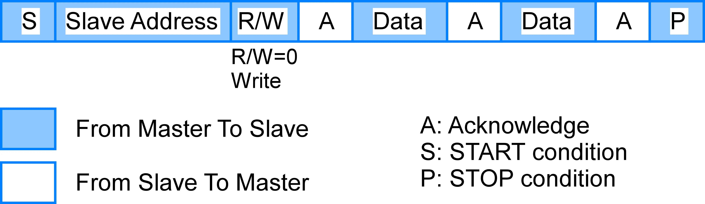
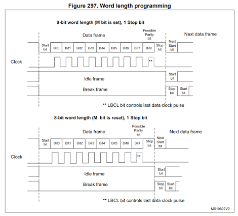

# Task_01

> **광운대학교 컴퓨터정보공학부**  
> **작성자:** 장경민  
> **제출일:** 2026. 07. 31

---

## 1. 개요 (Overview)
본 과제는   
1 . I2C 통신의 SCL, SDA  
2 . UART 통신에서 사용되는 232 통신과 485 통신  
에 관한 보고서이다.

### 핵심 목표
* I2C 통신에 관하여 정의, 사용법, 원리
* ATMega128에의 I2C통신. 사용법, SCL, SDA에 관해
* UART 통신에 관하여
* UART 통신에서 232 통신과 485 통신의 장단점 및 차이

---

## 2. I2C통신

I2C 통신은 1982년에 개발된 통신 단거리 시리얼 통신 방법이다. I2C통신은 N개의 마스터와(보통 1개를 사용한다) N개의 슬레이브가 통신할 수 있다. I2C는 SCL, SDA 2개의 핀을 이용하여 통신하는데, SCL은 마스터가 생성하는 클럭을 전송하고, SDA는 데이터를 전송한다. 동기식 구조여서 양쪽의 BaudRate를 사람이 손으로 지정할 필요는 없다. 통신 방식은 반이중 통신이므로 데이터를 동시에 전송하지 못 할뿐, 마스터와 슬레이브 양방향으로 통신이 가능하다. 다만 모든 통신은 마스터가 주관하므로 슬레이브 - 슬레이브 통신은 불가능 하다. 마스터는 클럭을 생성하고 통신의 START/STOP상태를 주관하며 통신할 슬레이브의 주소를 지정한다. 마스터의 START명령아래에서 슬레이브의 주소와 데이터 전송 방향을 설정하고 ACK를 받으면 데이터와 ACK를 주고 받고, STOP 명령어로 종료한다.  

마스터 -> 슬레이브 방향의 통신. 슬레이브 -> 마스터 방향은 R/W가 1이고 Data와 ACK가 반전되어 있다. 자세한 주소지정이나 START/STOP 방식은 인터넷을 검색하라.

---

## 3. ATMega에서의 I2C통신

ATmega128에서의 I2C통신은 TWI(Two-Wire Interface)라는 내부 모듈을 이용하여 구현된다. TWI는 I2C와 호완되며 SDA, SCL에 관한 핀이 각각 PD0, PD1로 지정되어 있다. ATmega는 마스터와 슬레이브 모드 양쪽으로 설정 가능하며 마스터 모드일때 TWBR전체 비트와 TWSR의 하위 2개 비트를 이용하여 SCL 클럭 주파수를 설정 가능하다.  
ATmega128에서 TWI를 관장하는 레지스터는 다음과 같이 총 5개가 존재한다.  
 이름 | 설명 |
:--- | :--- |
 TWBR(TWI Bit Rate Register) | SCL클럭 주기를 설정하는 비트. |
 TWCR(TWI Control Register) | TWI의 동작을 지시하는 레지스터. |
 TWSR(TWI Status Register) | TWI의 상태를 전송완료 상태나 ACK수신 확인 등을 담당함. |
 TWDR(TWI Data Register) | 통신할 목적지 주소와 주고 받을 데이터를 저장하는 버퍼. |
 TWAR(TWI Slave Address Register) | ATmega가 슬레이브 모드일때 자신의 주소를 저장함  
 
 이를 이용하여 I2C통신을 할 수 있다.
 
 

---

## 4. UART 통신

UART 통신은 1960년대 부터 개발된 매우 오래되고 많이 사용되는 통신 방식이다. I2C와는 다르게 비동기 방식으로 양쪽의 BR과 비트수, 페리티코드, 스탑비트수 등을 설정하여야 하며, 보통 1:1통신을 기본으로 한다.  
  
동작을 안하고 있을때에는 HIGH를 출력하다가 전송이 시작되면 시작비트 LOW를 출력한다. 이 뒤에 데이터와 페리티 코드에 따라 H/L를 출력하고 마지막에 STOP비트 HIGH를 출력한다.

---
## 5. 232와 485에 관해
232통신과 485통신 모두 UART통신의 규약이다. 둘의 비교표는 다음과 같다.
| - | RS232| RS485|
| :--- | :--- | :---|
| 연결 수 | 1:1 | N:N |
| 신호 전달 방식 | H-L | 전압 차 |
| 통신 거리 | 15m 이내 | 1200m  이내 |
| 선의 수 | 3개 (RX TX GND) | 2개 (D+ D-) |
| 장점 | 간단하다   가격이 저렴함 | 노이즈에 강하다   다대다 통신을 지원하고 장거리 통신이 가능하다 |
| 단점 | 통신거리가 짧다   노이즈에 약하다 | 비싸다   485 칩 생산과 구축이 복잡하다. |

## 6. AI 툴 활용 명시 (AI Tools Declaration)
본 과제 작성 및 구현 과정에서 활용한 AI 도구(Generative AI)는 전부 **Claude AI**를 활용함

 활용 영역 | 세부 사용 목적 및 내용 |
 :--- | :--- |
 I2C관련 | 슬레이브 - 슬레이브 통신이 왜 안되는가? |

### AI 활용 및 검증 원칙
1. **궁금증 해결 :** 모르는 거나 궁금한것을 인터넷 검색과 AI한테 물어본다.
