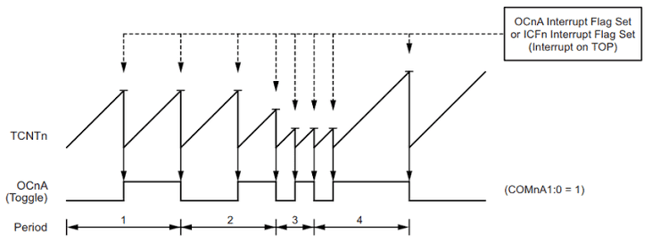
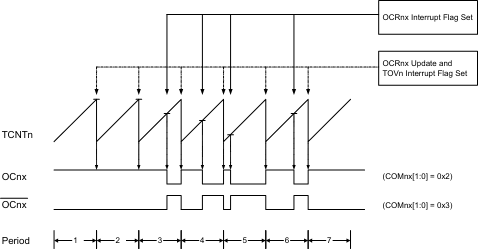
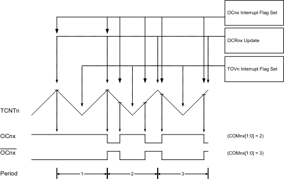
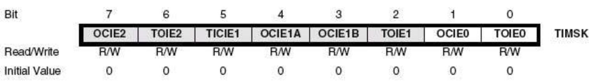
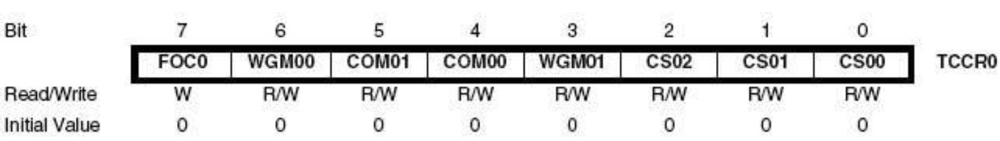
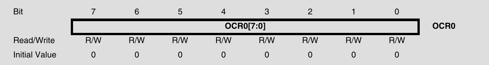
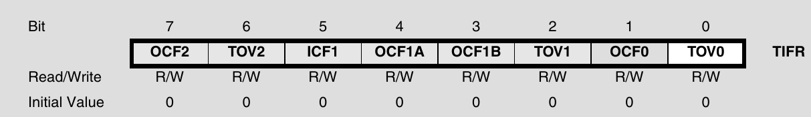
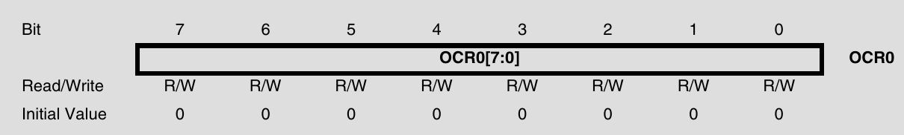

// 타이머 관련 레지스터# Day04_Task01

> **광운대학교 컴퓨터정보공학부**  
> **작성자:** 장경민  
> **제출일:** 2026. 08. 02.

---

## 1. 개요 (Overview)
본 과제는 ATmega에 내장된 8비트 타이머 TIMER 0/2에 관한 보고서이다.

### 핵심 목표
* TIMER 0/2의 정의 및 원리
* TIMER 0/2의 차이점 및 사용법

---

## 2. TIMER 0/2란  

TIMER 0/2는 ATmega128에 내장되어 있는 8비트 카운터/타이머 회로이다. 여기서 카운터는 외부의 입력(펄스)가 몇번 행해졌는지 세는 동작이고, 타이머는 MCU 내부의 클럭 혹은 외부의 크리스탈 등에서 오는 클럭의 횟수를 이용하여 시간을 계산하는 장치이다. 8비트 카운터/타이머이기 때문에 0~255 사이의 값을 계산할 수 있다. 한 클럭의 주기는 매우 짧기 때문에(16MHz에서는 62.5ns) 이를 우리가 원하는 길이로 늘리기 위해 프리스케일러를 이용한다. Prescale은 타이머 마다 할당된 크기가 다르고, 주파수는 소스에 따라 다르다.(우리가 사용하는 보드는 16MHz의 클럭 주파수를 가진다.) 이를 프리스케일된 길이와 입력받는 클럭주파수를 이용해 클럭의 개수를 세면 타이머로써 작동한다.

$$T = \frac{Prescale \times Count}{Freq_{MCU}}$$

---

## 3. TIMER0/2의 차이점

TIMER0/2는 둘다 8bit 카운터/타이머이다. 하지만 몇가지 차이점이 있다.
||TIMER0|TIMER2|
|:---|:---|:---|
|비동기|비동기 지원|비동기 지원 X|
|프리스케일러|7단계|5단계|
|클럭 입력|내부 클럭 or I/O클럭과 독립된 32kHz 크리스탈 시계 입력 가능(RTC 역할이 가능)|내부 입력 or 외부입력 카운터로 동작 가능|

---

## 4. TIMER0/2의 사용법

TIMER 0/2는 4가지의 모드가 있다. 각 모드는 **TCCRn** 레지스터의 6, 3번bit(WGMn) 비트를 조작하여 설정한다. 

### 4.1. Normal Mode 

기본 모드는 카운터를 저장하는 8bit 값(TCNTn)이 0 -> 255까지 계속 증가 하다가 오버플로우가 일어나면 TOVn(오버플로우 플래그)를 1로 바꾸고 0이 된다. 오버플로우가 일어날때 인터럽트도 수행된다.

### 4.2. Clear Timer on Compare Match Mode (CTC)

CTC모드는 자기가 원하는 카운터의 최대값(OCRn)을 설정하여 OCRn에 도달하면 TCNTn을 0으로 만들고 OCn을 COM 설정에 따라 바꾸고 인터럽트를 수행한다.

### 4.3. Fast PWM Mode
Fast PWM모드는 TCNTn는 0 -> 255까지 커지지만 OCRn을 설정하여 OCn를 COM 설정에 따라 바꿀수 있게 만든 모드이다. 펄스폭 변조를 생성할때 사용된다.

### 4.4. Phase Correct PWM Mode
PC PWM모드는 TCNTn이 0 -> 255 -> 0 으로 증가 감소하여 OCn을 COM 설정에 따라 바꿀수 있게 하는 모드이다. 느리지만 정확한 PWM을 생성하여 모터 제어 등에 사용된다.

### 4.5. 레지스터
TIMER는 2 + 1 + (1)개의 레지스터를 설정하여 사용한다. 출력은 1 + 2개의 레지스터에서 받는다.  

#### 4.5.1. Timer/Counter Interrupt Mask Register 
TIMER0/2가 공유하면서 사용하는 레지스터로써 인터럽트를 활성화 한다.

각각 Bit0:1, Bit6:7이 TIMER0, TIMER2 이다.
TOIEn은 오버플로우 인터럽트고 OCIEn은 OCRn을 넘기면 발생하는 인터럽트다.

#### 4.5.2. Timer/Counter Control Register 
타이머를 제어하는 레지스터로써 모드설정과 프리스케일러설정, 출력모드를 설정한다. 

위 사진은 TIMER0의 레지스터지만 TIMER2와 형식은 같다.

WGMn비트를 이용해 위의 4개의 모드 중 하나를 설정한다.

CSn를 이용하여 프리스케일러를 설정하는데 타이머에 따라 프리스케일 단계가 다르다.

COMn설정을 통해 TCNTn이 OCRn과 크기가 같아졌을때 OC핀(TIMER0 은 PB4, TIMER2는 PB7)의 행동(출력 등)을 정함. 인터럽트등을 이용해 핀을 조작 하여도 되지만 매우 빠른 고주파 생성이나 CPU에 부담을 덜기 위해 사용함.

#### 4.5.3. Output Compare Register

OCRn 의 값을 정하는 레지스터이다.

#### 4.5.4. Asynchronous Status Register
TIMER0에서만 존재하는 레지스터로써 비동기 타이머를 사용할 때 사용된다.

#### 4.5.5. Timer/Counter Interrupt Flag Register
타이머가 인터럽트가 발생하거나 OCRn과 접촉하였을때 세워지는 플래그이다. 타이머들이 레지스터를 공유한다.

TOIE와 비슷하게 2개의 Bit를 차지하고 있는데 각각 Bit0:1, Bit6:7가 TIMER0, TIMER2 이다. TOVn은 오버플로우, OCFn은 비교가 일어났을때 플래그가 세워진다.

#### 4.5.6. Timer/Counter Register
카운터가 구동되고 있을때 현재 카운터 값을 저장하는 레지스터이다. 사용자가 레지스터를 읽고 쓸수 있지만 구동중에 값을 쓰면 문제가 될 수 있다.

---

## 6. AI 툴 활용 명시 (AI Tools Declaration)
본 과제 작성 및 구현 과정에서 활용한 AI 도구(Generative AI)는 전부 **Claude AI**를 활용함

 활용 영역 | 세부 사용 목적 및 내용 |
 :--- | :--- |
 TIMER 관련 이론| - 검색이나 데이터시트 만으로 이해가 안가는 것을 질문함 |
 COM비트 | - 인터럽트 대신 OC를 사용하는 이유에 관한 질문 |
 TOV에 관한 동작 | - TOV가 토클 하는것인가 1로 바뀌는 것인가 |
 보고서 관련 | - 보고서에서 맞춤법 교정 마크다운 문법에러, 개념 오류 등 |
 

### AI 활용 및 검증 원칙
1. **궁금증 해결 :** 모르는 거나 궁금한것을 인터넷 검색과 AI한테 물어본다.
2. **문서화 :** 문서화 작업에서 문법 교정이나 약간의 피드백만을 맡긴다.
