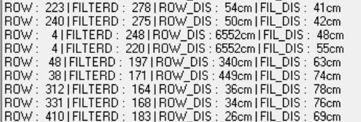

# Day04_Task04

> **광운대학교 컴퓨터정보공학부**
> **작성자:** 장경민
> **제출일:** 2026.08.03.

---

## 1. 개요 (Overview)
PSD 센서를 이용해 거리를 측정할 때 필터를 사용하는 프로그램이다.

### 핵심 목표
* 2Y0A02 PSD 센서를 ADC를 이용해서 입력 받음.
* ADC값을 적절한 식을 이용해 거리를 구한다.
* ADC값을 필터(이동평균)를 거친 후 거리를 구한다.

---

## 2. 개발 환경 (Environment)

| 항목 | 내용 |
| :--- | :--- |
| **MCU** | ATmega128A (16MHz External Crystal) |
| **IDE / Compiler** | Microchip Studio 7.0 / Microchip AVR GCC |
| **Flasher Tool** | USBISP / STK500 |
| **언어** | C Language |
| **주요 부품** | ATmega128 개발보드, PSD |

---

## 3. 하드웨어 구성 및 핀 맵 (Hardware Structure)

### Pin Configuration

```text
[ATmega128]                         [Target Component]
 USART1 (PD0:1)			 ----->		 PC 시리얼 통신
 ADC7 (PF7)              ----->      PSD 
```

### 주요 회로 특징
* **전원:** USB를 이용한 전원 공급
* **PSD 센서:** PSD센서를 이용해 거리를 측정한다. 

---

## 4. 프로젝트 구조 (Directory Structure)
```text
├── Day04_Task04/
│   ├── main.c
└────── circuit.jpg
```

---

## 5. 핵심 코드 및 레지스터 설정 (Key Implementation)

### 레지스터 설정 (`main.c`)
```c
UBRR1H = 0x00;
UBRR1L = 103; // 9600bps 사용
UCSR1A = 0x20; // 송신, 수신 상태비트 초기화
UCSR1B = 0x18; // 송신, 수신 기능 활성화
UCSR1C = 0x86;

ADMUX = 0x47; // AVCC 전압 사용 ADC7번을 단일종단이득으로 설정
ADCSRA = 0x87; // ADC 활성화 및 분주비 128 사용
```

### 이동평균 값 구하기
```c
moving_avg_list[index] = adcValue; // 이동평균 리스트를 저장함
index++;
if(index == MAX_MOV_AVG_NUM)
	index = 0;

moving_avg = 0; // 이동평균값 초기화
for(int i = 0; i < MAX_MOV_AVG_NUM; i++)
{
	moving_avg += moving_avg_list[i];
}
moving_avg /= MAX_MOV_AVG_NUM;

```


---

## 6. 동작 설명 및 결과 (Results)

### 동작 시나리오
1. ADC값, 필터된 ADC값, 거리, 필터된 ADC값을 이용한 거리 (ROW / FILTERD / ROW_DIS / FIL_DIS)를 화면에 출력한다.

### 동작 사진 / 영상

| 동작 모습 |
| :---: |
| [▶ 동작 영상 보기](https://drive.google.com/file/d/1EJUovx2u3EGraIfoAI2QnkZY-cC3VUag/view?usp=sharing) |

---

## 7. 사용된 필터

사용된 필터는 주식차트 등에도 쓰이는, 가장 간단한 이동평균 필터이다. 이동평균 필터는 최근 N회 입력의 평균을 출력하는 필터이다. 이동평균을 이용하면 값이 살짝 뒤로 밀리면서 전체의 경향을 보여주는 효과가 나타난다. 전체평균이나 칼만필터등은 재귀적으로 구할 수 있으나 이동평균은 그럴 수 없어서 배열을 이용하여 마치 환형 리스트 처럼 사용하였다.



위는 날것 그대로의 데이터와 이동평균을 적용한 데이터의 사진이다. 중간의 6552cm과 같은 값 처럼 터무니없이 값이 튀어도 이동평균은 특이값을 뭉개 버리는 성질이 있으므로 안정적인 입력이 들어온다.

## 8. AI 툴 활용 명시 (AI Tools Declaration)
본 과제 작성 및 구현 과정에서 활용한 AI 도구(Generative AI)는 **Claude AI**이며, 사용 현황 및 목적은 다음과 같음. 

| 도구명 (Tool) | 활용 영역 | 세부 사용 목적 및 내용 |
| :--- | :--- | :--- |
| **Claude** | 코드 디버깅 | - 출력이 깨지는 문제 <br> - prt_chr[25] 크기가 너무 작은 문제, prt_chr[80]으로 수정 함. |


### AI 활용 및 검증 원칙
1. **학습 주도성:** 코드의 핵심 제어 로직 설계는 직접 작성하였으며, AI는 보조 도구(디버깅, 문서화, 검색 대용)로만 활용하였습니다.
