# TIMER01 레지스터

> **광운대학교 컴퓨터정보공학부**  
> **작성자:** 장경민  
> **제출일:** 2026. 08. 03.

---

## 1. 개요 (Overview)
본 과제는 TIMER1 Register 설정에 관한 설명 보고서 이다.

### 핵심 목표
* TIMER1 Register 설명
* TIMER1 Register 설정

---

## 2. TIMER1 레지스터 종류 및 설명

TIMER1은 16비트 카운터/타이머이다. TIMER1은  다음과 같은 종류의 레지스터가 존재한다.
|이름|역할|
|:---|:---|
|TCCR1A, TCCR1B, TCCR1C|타이머1의 설정을 담당한다.|
|TCNT1H/L|16bit 카운터 역할을 한다.|
|OCR1AH/L, OCR1BH/L, OCR1CH/L|여러 모드에서 비교 피연산자 역할을 수행한다.|
|ICR1H/L|입력캡쳐, TOP값 지정등에 사용된다.|

아래는 TIMER1/2/3 등과 같이 사용하는 레지스터이다.

|이름|역할|
|:---|:---|
|SFIOR|특수목적 레지스터. 프리스케일러 리셋 설정 등을 지정한다.|
|TIMSK|인터럽트를 설정을 담당한다.|
|ETIMSK|추가적인(확장된) 인터럽트 설정을 담당한다.|
|TIFR|인터럽트 발생시 플레그를 담당한다.|
|ETIFR|추가적인(확장된) 인터럽트 플레그를 담당한다.|

ETIMSK, ETIFR등이 추가된 이유는 역사적으로 타이머의 개수와 비교채널(OCRnX)가 2개 씩 밖에 없어서 하나의 8bit 레지스터에 모두 넣을 수 있었지만, 타이머와 채널이 추가되면서 8bit만으로는 부족해져서 확장된 레지스터를 넣었다.

---

## 3. 레지스터 사용법

### 3.1. Timer/Counter1 Control Register A (TCCR1A)

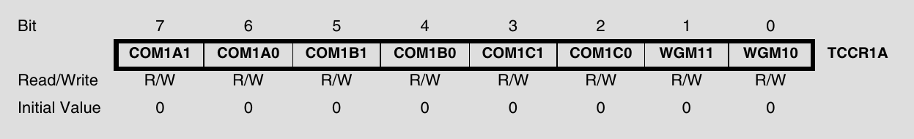

TCCR1A는 크게 2가지 부분으로 나뉘어 있다. 상위 6개 비트를 구성하는 OCnX핀의 출력 설정을 담당하는 부분(COM1[ABC]0, COM1[ABC]1), 하위 2개 비트를 구성하는 타이머 모드를 설정하는 부분(WGMn0, WGMn1)이다. 

#### 3.1.1. Compare Output Mode for Channel (COMn)

COMn 은 OCnX의 출력에 관한 설정이다. OCnX는 다음과 같은 3개의 채널로 구성된다.(OC1A, OC1B, OC1C) 각 채널의 모드는 2개의 비트를 이용하여 구성되고 PWM or 비PWM에 따라 설정이 달라진다.

아래는 비PWM 모드(Normal/CTC등)일때 동작이다.
|COMnA/B/C1|COMnA/B/C0|설명|
|:---| :--- |:---|
|0|0|기본 핀 출력(OCn 모드로 출력 안함)|
|0|1|OCn을 토클한다.|
|1|0|OCn을 LOW로 만든다.|
|1|1|OCn을 HIGH로 만든다.|

#### 3.1.2. Waveform Generation Mode (WGMn)

WGMn은 타이머 모드를 설정하는 부분으로 TCCR1B의 WGMn0, WGMn1과 합쳐서 총 16개의 모드를 구성할 수 있다.

### 3.2. Timer/Counter1 Control Register B (TCCR1B)

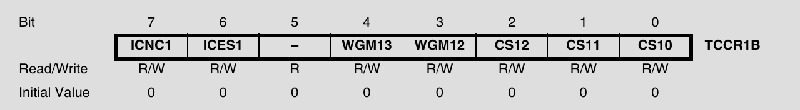
TCCR1B는 크게 3개의 부분으로 구성된다. 상위 2개 비트는 카운터 입력 단자PD4(ICP1)의 입력파형에서 노이즈 제거 관련 부분이다. Bit4:3는 타이머 모드를 설정하는 부분으로 TCCnA의 WGM의 연장선상에 있다. 하위 3개의 비트(CSn)는  프리스케일러에 관한 부분이다.

#### 3.2.1. Input Capture Noise Canceler /  Input Capture Edge Select (ICNC/ICES)

ICNC와 ICES는 ICP의 입력 노이즈 처리에 관한 설정이다. ICNC를 1로 두면 4개의 연속된 입력을 이용하여 잡음을 제거한다. ICES는 HIGH에서 처리할 지 LOW에서 처리 할지 정한다.

#### 3.2.2. Waveform Generation Mode (WGMn)

TCCR1A 의 WGM10:1과 결합하여 타이머 모드를 설정한다. 총 16개의 모드가 있는데 그중 4가지 모드를 주로 사용한다.

|번호|이름|설명|
|:--|:--|:--|
|0|Normal|가장 기본적인 모드이다. TIMER0에서 normal과 동일하게 작동한다.|
|4|CTC|카운터가 OCRn에 도달하면 인터럽트가 동작하고 플래그를 세운다. 카운터가 계속 증가하여 TOP에 도달하면 0으로 리셋된다.  정확한 주기를 셀때 사용한다.|
|14|FastPWM|카운터가 0 -> TOP까지 갔다가 0으로 내려오는 톱니파를 생성하는 모드다. OCRnA/B/C등을 이용해서 PWM을 생성할때 사용한다. |
|10|PWM, Phase Correct|카운터가 0 -> TOP -> 0이 반복되는 삼각파를 그리는 모드다. OCRnA/B/C등을 이용해서 더 정확한 PWM을 생성할때 사용한다. |

나머지 모드들은 16bit를 8/9/10bit로 변환하여 사용하거나 TOP 레지스터를 설정할때 사용한다.

#### 3.2.3. Clock Select (CSn)
3개의 비트를 이용해서 프리스케일러를 설정하는 부분이다. 
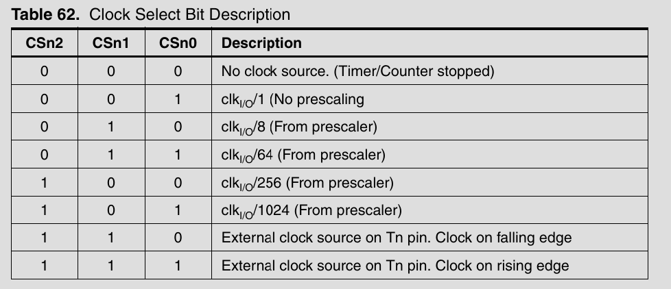  
프리스케일러는 0(정지)+1,8,64,256,1024의 5단계가 있고(0이면 타이머가 멈춘다.) 아래 2개는 외부 입력을 세는 카운터로써 동작할 때 하강/상승 엣지를 선택한다.

### 3.3. Timer/Counter1 Control Register C (TCCR1C)

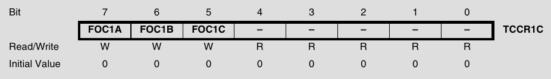

TCCR1C는 3개의 비트로 구성되어 있으며, 1로 적으면 비교매치가 일어난것 처럼 OCRnA/B/C를 강제로 동작 시킨다. 이때 동작은 앞에 설정되어 있는(COMnA/B/C) 동작을 실행하고, 타이머와 별개로 진행하며, 인터럽트나 플래그 등은 세우지 않는다.

### 3.4. Timer/Counter1 (TCNT1H and TCNT1L)

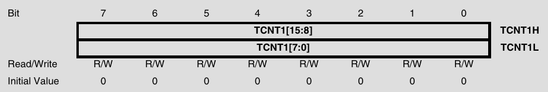

16bit 카운터 저장소 역할을 한다. 읽고 쓸수 있으나 타이머 동작중에 쓰면 문제가 생길 수 있다.

### 3.5. Output Compare Register 1/2/3 A/B/C (OCR1AH, OCR1AL, OCR1BH, OCR1BL, OCR1CH, OCR1CL)

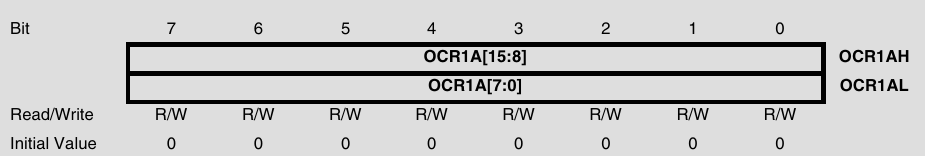

출력 비교 레지스터이다. 여러 모드에서 비교매치를 수행할 때 그 값을 세팅하는 용도로 사용된다. 

### 3.6. Input Capture Register (ICR1H, ICR1L)

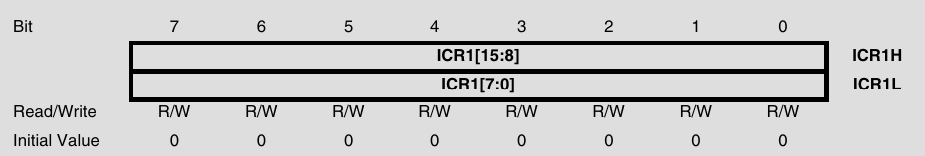

ICRn 레지스터는 2가지 기능으로 사용 된다. 먼저 몇몇 모드에서 TOP값을 지정할 때 사용할 수 있다. 또한 몇몇 모드에서 ICP 핀에 입력이 들어오면 TCNT값을 저장(캡쳐)하는데 사용한다.

### 3.7. Special Function IO Register (SFIOR)

여러가지 잡다한 설정들을 세팅하는 비트이다. TSM은 프리스케일러 회로를 동조화 시킬때 사용하고 PSR은 프리스케일러 회로를 리셋할 때 사용한다. 나머지는 타이머와 관련이 없다.

PSR321은 하나의 비트로 구성되어 있다. 이때 하나의 프리스케일러를 사용하면 각각 다른 분주비를 설정하지 못하는거 아닌가 하는 의문이 들었지만, 프리스케일러 회로가 하나여도 각각의 분주비스케일 마다 출력회로가 장착되어 있어서 각기 다른 분주비를 출력할 수 있다는것을 알게 되었다.

### 3.8. (Extended) Timer/Counter Interrupt Mask Register (E/TIMSK)
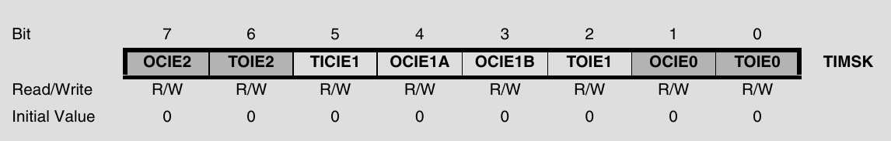

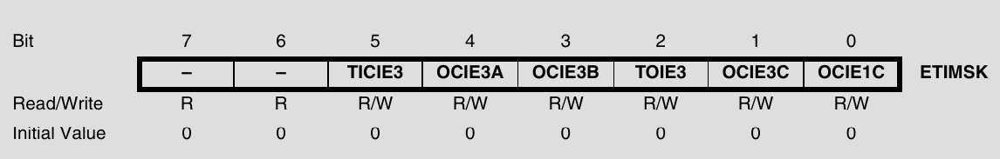

TIMER1,2,3의 인터럽트 관련 레지스터이다.
|이름|역할|
|:---|:---|
|TOIE1|오버플로우가 발생하였을때 인터럽트가 작동함.|
|OCIE1A/B/C|비교매치가 일어났을때 인터럽트가 작동함.|
|TICIE1|ICP1에 입력이 들어오면 인터럽트를 실행함.|

### 3.9. (Extended) Timer/Counter Interrupt Flag Register (E/TIFR)

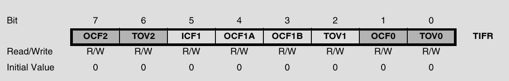
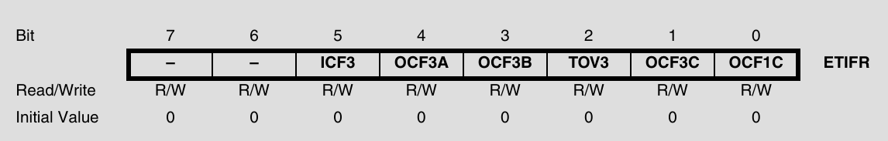

TIMER1/2/3의 특정 이벤트가 발생하면 플래그를 저장하는 레지스터 이다.
|이름|역할|
|:---|:---|
|TOV1|오버플로우가 발생하였을때 1이 됨.|
|OCF1A/B/C|비교매치가 일어났을때 1이 됨.|
|ICF1|ICP1에 입력이 들어왔을때 1이 됨.|

## 4. AI 툴 활용 명시 (AI Tools Declaration)
본 과제 작성 및 구현 과정에서 활용한 AI 도구(Generative AI)는 전부 **Claude AI**를 활용함

| 활용 영역 | 세부 사용 목적 및 내용 |
| :--- | :--- |
| 정의 관련 궁금증 해결 | - 데이터 시트를 보고 추가적인 질문   - WGM에서 주로사용하는 모드, 레지스터의 구조와 비트에 대한 상세한 설명 등 |
| 프리스케일러 동작 원리에 관한 질문 | - 프리스케일러 리셋 비트를 123이 공유하고 있는데 그러면 비트를 나누어 출력할 수 없는것이 아닌가? |
| 입력 캡처 | - 입력캡쳐 기능이 정확히 무엇을 뜻하는가?   - 어디에 사용할 수 있는가? |
|강제 출력 비교 | FOC기능이 정확히 무엇을 의미하는가|
| 맞춤법 및 단어 교정 | - 보고서의 맞춤법 및 단어 교정에 도움을 받음 |

### AI 활용 및 검증 원칙
1. **궁금증 해결 :** 모르는 거나 궁금한것을 AI에게 물어본다.